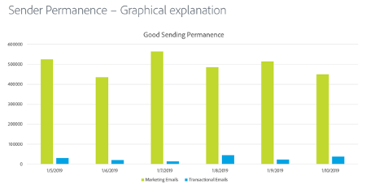
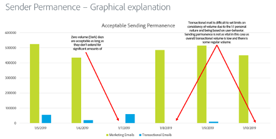

# 보낸 사람 영구

영구 전송은 ISP의 명성을 유지하기 위해 일관된 전송 볼륨 및 전략을 설정하는 프로세스입니다. 다음은 보낸 사람의 영속성이 중요한 이유입니다.

* 일반적으로 스팸은 &quot;IP 주소 홉으로, 이는 평판 문제를 피하기 위해 여러 IP 주소에서 지속적으로 트래픽을 이동한다는 의미입니다.
* 일관성은 ISP에게 보낸 사람이 신뢰할 수 있고 좋지 않은 전송 작업으로 인해 발생하는 모든 평판 문제를 자체적으로 통과하려고 시도하지 않는다는 것을 입증하는 데 중요합니다.
* 일부 ISP가 보낸 사람을 신뢰하는 것으로 간주하기 전에 이러한 일관성 있는 전략을 오랫동안 유지 관리하는 것이 필요합니다.

**다음은 몇 가지 예입니다.**

