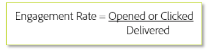

# 전환 프로세스 - 이메일 플랫폼 전환

ESP(Email Service Provider)를 이동할 때는 기존의 기존 IP 주소도 전환할 수 없습니다. 새로 시작할 때 긍정적인 명성을 얻기 위한 최상의 방법을 따라야 합니다. 사용 중인 새 IP 주소는 아직 명성에 맞지 않으므로 ISP는 이러한 IP 주소를 완전히 신뢰할 수 없으며 고객이 고객에게 배달할 수 있도록 허용하는 것에 대해 신중해야 합니다.

새로운 사람을 만날 때 무엇을 하는지 생각해 보세요. 일반적으로 신뢰는 바로 신뢰하지 않고 구축할 필요가 있습니다. 고객이 나쁜 일을 하기 위해 여러분의 이름을 사용할 것이기 때문에 브랜드는 이러한 신뢰에 자동으로 도움이 될 것이라고 생각하지 마십시오. 이메일 전달 시 ISP는 행동 방식을 재고해야 합니다.

긍정적인 평판을 얻는 것은 과정이다. 하지만 일단 그것이 만들어지면, 작은 부정적인 지표들은 당신과 당신의 우편물 배달에 덜 영향을 줄 것입니다.

IP 주소 및 도메인을 따뜻하게 하는 데 걸리는 시간은 다를 수 있지만, 일반적인 발신자가 대부분의 Tier 1 ISP([!DNL Gmail], [!DNL Microsoft], [!DNL Verizon]/[!DNL Yahoo]/[!DNL AOL]등)에서 명성을 얻는 것은 일반적으로 8주 기준입니다.
다음 섹션에서는 제대로 탑승하기 위해 주력할 몇 가지 핵심 영역을 조사합니다.

## 인프라

성공적으로 배달할 수 있는 방법은 강력한 기반을 구축하는 것입니다. 이메일 인프라는 핵심 요소입니다. 적절하게 구성된 이메일 인프라에는 도메인 및 IP 주소 등 여러 구성 요소가 포함됩니다. 이러한 구성 요소는 사용자가 보내는 이메일의 배후의 기계와 비슷하며, 종종 명성을 보내는 것의 중요한 요소가 됩니다. 제공 능력 컨설턴트는 구현 중에 이러한 요소가 올바르게 설정되도록 보장하지만, 평판 요소 때문에 이러한 기본적인 이해를 유지하는 것이 중요합니다.

### 도메인 설정 및 전략

시간이 변경되었으며, 일부 ISP(예: [!DNL Gmail] 및 [!DNL Yahoo])는 이제 보낸 사람에게 이메일 명성을 첨부하는 것에 대해 도메인 명성을 추가한다. 도메인 명성은 IP 주소 대신 전송 도메인을 기반으로 합니다. 이는 ISP 필터링 결정에 있어서 브랜드가 우선함을 의미합니다.

Adobe Campaign의 새로운 발신자를 위한 온보딩 프로세스의 일부에는 전송 도메인을 설정하고 인프라가 올바르게 설정되었는지 확인하는 내용이 포함되어 있습니다. 장기적으로 사용할 도메인을 결정할 때 전문가와 함께 작업해야 합니다. 다음은 좋은 도메인 전략을 만드는 몇 가지 팁입니다.

* 사용자가 해당 메일을 스팸으로 잘못 식별하지 않도록 선택한 도메인에 대해 최대한 명확히 하고 반영하는 것이 좋습니다. 몇 가지 예 [!DNL newsletter.foo.com]는 [!DNL receipts.foo.com]다음과 같습니다.
* 조직의 메일 전달에 영향을 줄 수 있으므로 부모 또는 회사 도메인을 사용하면 안 됩니다.
* 전송 도메인을 합법화하려면 부모 도메인의 하위 도메인을 사용하는 것이 좋습니다.
* 거래 및 마케팅 메시지 카테고리에 대한 하위 도메인을 구분합니다. 이를 통해 ISP가 이러한 이메일 전송 방법을 찾는 경우 이메일 트래픽 흐름이 보다 안정적이게 되는데, 이는 잘 알려진 이메일 모범 사례이며 권장됩니다.

### IP 전략

긍정적인 명성을 얻기 위해서는 잘 짜여진 IP 전략을 세우는 것이 중요하다. IP 및 설정 수는 비즈니스 모델 및 마케팅 목표에 따라 다릅니다. 전문가와의 협력을 통해 정확한 시작 전략을 개발할 수 있습니다. 다음 사항을 고려해야 합니다.

* 너무 많은 IP는 스팸메일 배달을 최대화하기 위해 많은 IP에 트래픽이 분산되는 스피커가 사용하는 스노슈에 대한 일반적인 전술이므로 명성에 문제가 생길 수 있다. 스팸 사용자가 아니더라도 너무 많은 IP를 사용하는 경우, 특히 해당 IP에 이전 트래픽이 없는 경우 이러한 IP를 사용하는 것처럼 보일 수 있습니다.
* 너무 적은 IP로 인해 처리량 문제가 발생하고 잠재적으로 평판 문제가 발생할 수 있습니다. 처리량은 ISP에 따라 다릅니다. ISP가 기꺼이 받아들이고자 하는 양과 속도는 일반적으로 인프라를 기반으로 하고 평판 기준을 보내는 것입니다.
* 메시징 유형에 대한 트래픽 분리가 중요합니다. 별도의 IP 풀에 마케팅 및 트랜잭션 메일을 최소 수준으로 구분해야 합니다.
* 메일 전략에 따라 명성에 크게 차이가 나는 경우 서로 다른 제품 또는 마케팅 스트림을 다른 IP 풀에서 구별하는 것이 좋습니다. 일부 마케터는 지역별로 세그먼트화할 수도 있습니다. 평판이 낮은 트래픽의 IP를 구분하면 평판 문제가 해결되지는 않지만, &quot;정상&quot; 평판 이메일 전달과 관련된 문제가 방지됩니다. 결국, 여러분은 더 위험 많은 관객을 위해 좋은 청중을 희생하고 싶지 않을 것입니다.

### 피드백 루프

Adobe Campaign은 바운스, 불만, 구독 취소 등과 관련된 데이터를 처리하고 있습니다. 이러한 피드백 루프의 설정은 전달 가능성에 중요한 측면입니다. 불만 사항은 명성을 손상시킬 수 있으므로 타겟 대상의 불만을 등록하는 이메일 주소를 제거해야 합니다. 이 데이터를 다시 제공하지 [!DNL Gmail] 않는다는 점에 주목해야 합니다. 목록 구독 취소 헤더 및 참여 필터링은 현재 대부분의 구독자 데이터베이스를 구성하는 [!DNL Gmail] 가입자에게 특히 중요합니다.

### 인증

인증은 ISP가 보낸 사람의 ID를 확인하는 데 사용하는 프로세스입니다. 가장 일반적인 두 가지 인증 프로토콜은 [!DNL Sender Policy Framework (SPF)] 및 [!DNL DomainKeys Identified Mail] (DKIM)입니다. 최종 사용자는 볼 수 없지만 ISP가 확인된 보낸 사람의 이메일을 필터링하는 데 도움이 됩니다. [!DNL Domain-based Message Authentication Reporting and Conformance] (DMARC)는 모든 ISP가 자사의 명성에 대해 아직 도입하지 않고 있지만 인기를 얻고 있습니다.

#### **SPF**

[!DNL Sender Policy Framework (SPF)] 도메인 소유자가 해당 도메인에서 메일을 보내는 데 사용하는 메일 서버를 지정할 수 있는 인증 방법입니다.

#### **DKIM**

[!DNL Domain Keys Identified Mail (DKIM)] 는 위조 발신자 주소(일반적으로 칭함)를 검색하는 데 사용되는 인증 [!DNL spoofing]방법입니다. DKIM이 활성화되어 있으면 수신자가 해당 도메인에서 메일을 보낼 수 있는지 여부를 확인할 수 있습니다.

#### **DMARC**

[!DNL Domain-based Message Authentication, Reporting and Conformance (DMARC)] 는 도메인 소유자가 권한 없는 사용으로부터 도메인을 보호할 수 있는 인증 방법입니다. DMARC는 SPF 또는 DKIM을 사용하거나 둘 모두를 사용하여 도메인 소유자가 인증이 실패한 메일에 발생하는 상황을 제어할 수 있도록 합니다.전달, 격리 또는 거부됨.

## 타깃팅 기준

새 트래픽을 전송할 때는 IP 온난화의 초기 단계 동안에만 가장 높은 참여 사용자를 타깃팅합니다. 따라서 참여도가 낮은 고객에게 도달하기 전에 효과적인 신뢰 구축을 위해 처음부터 긍정적인 평판을 얻는 데 도움이 됩니다. 참여에 대한 기본 공식은 다음과 같습니다.

일반적으로 참여 비율은 특정 기간을 기반으로 합니다. 이 지표는 공식이 전체 수준에 적용되었는지 또는 특정 메일링 유형 또는 캠페인에 적용되었는지에 따라 크게 달라질 수 있습니다. 모든 보낸 사람과 ISP는 다르며, 일반적으로 맞춤형 플랜이 필요하므로, Adobe Campaign 제공 컨설턴트와 함께 작업하여 특정 타깃팅 기준을 제공해야 합니다.

## IP가 따뜻해지는 동안 ISP별 고려 사항

ISP는 다른 규칙과 트래픽 보기 방법을 가집니다. 예를 들어, [!DNL Gmail] 다른 모든 평판 측정 외에 매우 엄격하게(열고 클릭) 참여를 보기 때문에 가장 정교한 ISP 중 하나입니다. 이를 위해서는 처음에 참여도가 가장 높은 사용자만 타깃팅하는 사용자 정의 계획이 필요합니다. 다른 ISP도 동일하게 필요합니다. 특정 플랜에 대한 Adobe Campaign 전달 컨설턴트와 상담하십시오.

## 볼륨

당신이 보내는 우편물 양은 긍정적인 명성을 얻기 위해 매우 중요하다. 자신을 인터넷 접속장치 속에 집어넣으세요. 만약 여러분이 모르는 사람으로부터 엄청난 양의 트래픽을 보이기 시작한다면, 걱정되겠지요. 많은 양의 우편을 즉시 보내는 것은 위험하며, 평판 문제를 해결하기가 매우 어려운 것으로 확신합니다. 너무 빨리 너무 많이 보내면서 발생하는 문제들, 나쁜 명성에 빠져드는 것은 좌절감을 주고 시간 소모적이며 비용이 많이 들 수 있다.

볼륨 임계값은 ISP마다 다르며 평균 참여 지표에 따라 달라질 수 있습니다. 일부 전송자는 매우 낮고 느린 볼륨 램프가 필요한 반면, 다른 전송자는 볼륨 경사를 허용할 수도 있습니다. Adobe Campaign 제공 컨설턴트와 같은 전문가와의 협력을 통해 맞춤형 볼륨 플랜을 개발하는 것이 좋습니다.

다음은 원활한 전환 방법을 위한 힌트 및 팁입니다.

* **권한은** 성공적인 이메일 프로그램의 기초입니다.
* **전송 볼륨이 적으면 시작** 시간이 단축되고 발신자의 명성을 높일 수 있습니다.
* 서로 **연동되는 우편 전략을** 사용하면 이메일 일정을 중단하지 않고도 현 ESP를 통해 단계적으로 볼륨 캠페인을 전개할 수 있습니다.
* **참여 문제** - 이메일을 정기적으로 열고 클릭하는 가입자로부터 시작합니다.
* **수백 명의 Adobe Campaign 고객이 이메일 프로그램을 성공적으로 향상시킬 수 있도록 Adobe의 권장 사항을 따릅니다** .
* **회신 이메일 계정을 모니터링합니다**. 고객이 응답하거나 사용하지 않는 것은 좋지 않은 경험 [!DNL nore-ply@xyz.com] 입니다.
* 비활성 주소는 부정적인 전달 가능성에 영향을 줄 수 있습니다. **새 IP가 아닌 현재 플랫폼에서 다시 활성화하고** 사용 권한을 다시 설정합니다.
* **도메인** - 회사 실제 도메인의 하위 도메인인 전송 도메인을 사용합니다. 예를 들어 회사 도메인이 [!DNL xyz.com][!DNL email.xyz.com] 있는 경우 ISP에 대한 신뢰도는 [!DNL xyzemail.com]
* **투명성** - 이메일 도메인에 대한 등록 세부 사항은 공개적으로 사용할 수 있어야 하며 비공개로 설정해서는 안 됩니다.

많은 상황에서 거래 기반의 우편은 전통적인 홍보 방식의 접근 방식을 따르지 않는다. 일반적으로 이메일 터치를 트리거하는 사용자 상호 작용이 필요하므로 트랜잭션 메일의 볼륨을 제어하기가 어렵습니다. 경우에 따라 트랜잭션 메일은 공식 계획 없이 간단하게 전송할 수 있습니다. 다른 경우에는 시간이 지남에 따라 각 메시지 유형을 전환하여 볼륨을 느리게 확장하는 것이 좋습니다. 예를 들어 다음과 같이 전환할 수 있습니다.

1. 구매 확인 - 일반적으로 높은 참여
2. 장바구니 포기 - 일반적으로 중간 높은 참여
3. 환영 이메일 - 참여도가 높지만 목록 수집 방법에 따라 잘못된 주소를 포함할 수 있습니다.
4. 재구독 이메일 - 일반적으로 참여 감소

## 추가 리소스

* [새 플랫폼 시작](https://docs.adobe.com/content/help/en/campaign-standard/using/testing-and-sending/managing-deliverability/starting-new-platform.html)
