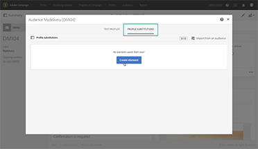

# Adobe Campaign Standard - 개요

Adobe Campaign은 크로스채널 고객 경험을 디자인할 수 있는 플랫폼을 제공하며 시각적 캠페인 오케스트레이션, 실시간 상호 작용 관리 및 크로스채널 실행 환경을 제공합니다. 이 사용 안내서에는 Adobe Campaign Standard의 다양한 기능과 성능에 대한 비디오 및 튜토리얼이 포함되어 있습니다.

## 새로운 기능

* **[Campaign 컨트롤 패널 - 워크플로우 모니터링](https://experienceleague.adobe.com/docs/control-panel-learn/control-panel/performance-monitoring/monitor-workflows.html?lang=ko){target=&quot;_blank&quot;}**

   *인스턴스의 데이터베이스나 워크플로우 문제를 방지하기 위해 워크플로우의 임시 스토리지 사용을 모니터링하는 방법 및 워크플로우 설정을 구성할 수 있는 위치를 알아봅니다.*

* **[Campaign 컨트롤 패널 - 처리량 및 지연 모니터링](https://experienceleague.adobe.com/docs/control-panel-learn/control-panel/performance-monitoring/monitor-throughputs-and-latency.html?lang=ko){target=&quot;_blank&quot;}**

   *캠페인 인스턴스의 게재 처리량 및 트랜잭션 메시지 지연을 모니터링하는 방법을 알아봅니다.*

## 직원 추천

<table>
<tr>
  <td>
    
    

      <a href="./communication-channels/email/profile-substitution.md">
    <strong>프로필 대체 - 타겟팅된 프로필을 사용하여 이메일 메시지 테스트 (비디오)</strong>
    </a>
    

    

    <em>검토용 증명에 실제로 해당 프로필이 받게 되는 메시지와 정확히 같은 내용을 넣어 보내는 방법을 알아봅니다.</em>
    

  </td>
   <td>
    
    

    <a href="https://experienceleague.adobe.com/docs/campaign-standard-learn/control-panel/control-panel-overview.html?lang=ko">
    <strong>Campaign 컨트롤 패널(비디오)</strong>
    </a>
    

    

    <em> Campaign 컨트롤 패널을 통해 설정 및 인스턴스 사용을 추적하여 관리자로서의 효율성을 높일 수 있습니다.</em>
    

  </td>
  <td>
    
    

      <a href="https://experienceleague.adobe.com/docs/campaign-standard-learn/getting-started-with-push-notifications-android/introduction.html?lang=ko">
    <strong>튜토리얼: Android™에서 푸시 알림 시작하기</strong>
    </a>
    

    

    <em>이 튜토리얼에서는 Adobe Campaign에서 푸시 알림을 보내고 Android™ 앱에서 해당 알림을 받는 단계를 안내합니다. </em>
    

  </td>
</tr>
</table>

## 추가 리소스

* [설명서](https://experienceleague.adobe.com/docs/campaign-standard/using/campaign-standard-home.html?lang=ko)
