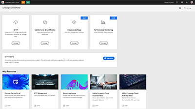

# Adobe Campaign Standard - 개요

Adobe Campaign은 크로스채널 고객 경험을 디자인할 수 있는 플랫폼을 제공하며 시각적 캠페인 오케스트레이션, 실시간 상호 작용 관리 및 크로스채널 실행 환경을 제공합니다. 이 사용 안내서에는 Adobe Campaign Standard의 다양한 기능과 성능에 대한 비디오 및 자습서가 포함되어 있습니다.

## 새로운 기능

* **[Adobe Analytics에서 배달 성공 추적](/help/integrations/track-the-success-of-your-deliveries-in-analytics.md)**

   *Campaign Standard 및 Analytics 통합을 구성하는 방법을 알아봅니다. Campaign Standard에서 받은 데이터와 사용할 수 있는 KPI를 사용하여 Analytics에서 보고서를 작성하는 방법을 이해합니다.*

## 직원 추천

<table>
<tr>
  <td>
    
    

      <a href="./communication-channels/email/profile-substitution.md">
    <strong>프로필 대체 - 타겟팅된 프로필을 사용하여 이메일 메시지 테스트 (비디오)</strong>
    </a>
    

    

    <em>프로필에서 받게 될 메시지의 정확한 표시를 사용하여 검토를 위한 증명을 보내는 방법을 배웁니다.</em>
    

  </td>
   <td>
    
    

    <a href="https://docs.adobe.com/content/help/ko-KR/campaign-standard-learn/control-panel/control-panel-overview.html">
    <strong>Campaign 컨트롤 패널(비디오)</strong>
    </a>
    

    

    <em> Campaign 컨트롤 패널을 통해 설정 및 인스턴스 사용을 추적하여 관리자로서의 효율성을 높일 수 있습니다.</em>
    

  </td>
  <td>
    
    

      <a href="https://docs.adobe.com/content/help/en/campaign-standard-learn/getting-started-with-push-notifications-android/introduction.html">
    <strong>자습서: Android용 푸시 알림 시작하기</strong>
    </a>
    

    

    <em>이 자습서에서는 Adobe Campaign에서 푸시 알림을 전송하고 Android 앱에서 해당 알림을 받는 것과 관련된 단계를 안내합니다. </em>
    

  </td>
</tr>
</table>

## 추가 리소스

* [설명서](https://docs.adobe.com/content/help/ko-KR/campaign-standard/using/campaign-standard-home.html)
