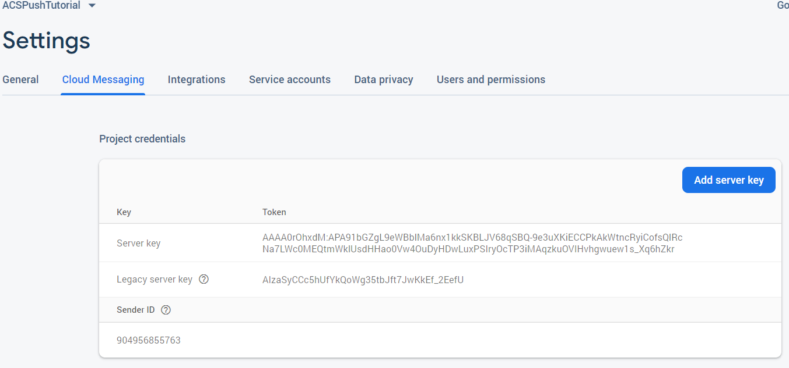

# 1단계 - 앱 [!DNL Android] 만들기 및 [!DNL Firebase Cloud Messaging]

이 부분에서는 Adobe Campaign Standard에서 보낸 [!DNL Android] 앱을 [!UICONTROL Push notifications] 수신하게 됩니다. 푸시 알림을 수신하려면 앱을 Google에 등록해야 합니다 [!DNL Firebase Cloud Service].

1. 계정에 [!DNL Firebase] 로그인합니다.

   [!DNL Firebase] 고품질의 앱을 신속하게 개발할 수 있는 Google의 모바일 플랫폼입니다. 계정이 없는 경우 [!DNL Firebase] 여기에서 계정 [을 만드십시오](https://firebase.google.com).

2. 론치 [!DNL Android Studio]
3. Click **[!UICONTROL File]** > **[!UICONTROL New]** > **[!UICONTROL New Project].**
4. **[!UICONTROL Empty Activity]**&#x200B;을(를) 선택하고 **[!UICONTROL Next]을(를) 클릭합니다 .**

   

5. 프로젝트에 의미 있는 이름을 입력합니다.

   이 데모를 위해 프로젝트를 *[!DNL ACSPushTutorial]*

   

6. 기본 패키지 이름을 적용하고 클릭하여 프로젝트 **[!DNL Finish]** 를 만듭니다.
7. 프로젝트 구조가 아래 스크린샷과 유사해야 합니다.

   

8. 클릭 **[!UICONTROL Tools]** > **[!UICONTROL Firebase].**(프로젝트를[!DNL Firebase]
9. **[!UICONTROL Set up Firebase Cloud Messaging]을(를) 클릭합니다.**

   

10. **[!UICONTROL Connect to Firebase]을(를) 클릭합니다.**
11. 앱이 Firebase에 연결되면 을 클릭합니다 **[!UICONTROL Add FCM to your app].**
12. **[!UICONTROL Accept Changes]을(를) 클릭합니다.**

   앱에 FCM을 추가하는 경우 프로젝트를 변경하려면 마법사에 권한이 있어야 합니다.

   ![[!DNL add-fcm-to-your-app]](assets/firebase-add-fcm-to-app.PNG)

앱과 Firebase를 성공적으로 통합하려면 아래와 같은 메시지를 받게 됩니다.

![[!DNL fcm-successfull]](assets/android-firebase-success.PNG)

[프로젝트가 콘솔 내에 [!DNL Firebase ]나열되는지 확인합니다.](https://console.firebase.google.com/)

## 설정 [!UICONTROL Push Channel] 구성

1. 콘솔에 [!DNL Firebase] 로그인
2. 프로젝트를 **[!UICONTROL ACSPushTutorial]** 엽니다.
3. 톱니바퀴 **아이콘을** 클릭하고 프로젝트 설정을 엽니다

   

4. Tab to the **[!UICONTROL Cloud Messaging]** tab.
5. 서버 키 복사

   

6. Adobe Campaign Standard 인스턴스에 로그인
7. Click **[!UICONTROL Adobe Campaign]** > **[!UICONTROL Administration]** > **[!UICONTROL Channels]** > **[!UICONTROL Mobile App].**
8. 적절한 항목을 선택합니다 **[!UICONTROL Mobile Application Property].**
9. 섹션에서 **[!DNL Android]아이콘&#x200B;**을&#x200B;**[!UICONTROL Push Channel settings]**클릭합니다.
10. 서버 키 필드에 서버 키를 붙여 넣습니다.

모든 것이 잘 되면 SUCCESS 메시지를 볼 수 있습니다.

요약하자면, Adobe는 이 [!DNL Android App] 를 제작하고 [!DNL Android App] 와 연결시켰습니다 [!DNL Firebase]. 그런 다음 앱의 서버 키를 Adobe Campaign Standard의 모바일 앱 [!DNL Android App] 에 붙여넣어 Adobe Campaign의 모바일 앱을 [!DNL Android] 과 연결했습니다.
