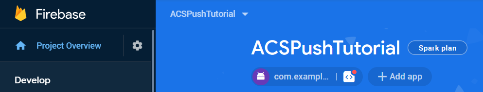

# 1단계 - 만들기 [!DNL Android] 앱 및 사용 구성 [!DNL Firebase Cloud Messaging]

이 부분에서 다음을 생성합니다 [!DNL Android] 받을 앱 [!UICONTROL Push notifications] Adobe Campaign Standard에서 전송됩니다. 푸시 알림을 수신하려면 앱을 Google의 [!DNL Firebase Cloud Service].

1. 에 로그인합니다. [!DNL Firebase] 계정이 필요합니다.

   [!DNL Firebase] 은 고품질 앱을 빠르게 개발하는 데 도움이 되는 Google의 모바일 플랫폼입니다. 없는 경우 [!DNL Firebase] 계정을 만드십시오. [여기에서](https://firebase.google.com).

2. Launch [!DNL Android Studio]
3. 클릭 **[!UICONTROL File]** > **[!UICONTROL New]** > **[!UICONTROL New Project].**
4. **[!UICONTROL Empty Activity]**&#x200B;을(를) 선택하고 **[!UICONTROL Next]을(를) 클릭합니다 .**

   

5. 프로젝트에 의미 있는 이름을 입력합니다.

   이 데모를 위해 프로젝트 이름을 *[!DNL ACSPushTutorial]*

   

6. 기본 패키지 이름을 적용하고 를 클릭합니다 **[!DNL Finish]** 프로젝트를 만들려면 다음을 수행하십시오.
7. 프로젝트 구조가 아래 스크린샷과 유사해야 합니다

   

8. 클릭 **[!UICONTROL Tools]** > **[!UICONTROL Firebase].** (여기에 프로젝트가 추가됩니다. [!DNL Firebase])
9. **[!UICONTROL Set up Firebase Cloud Messaging]를 클릭합니다.**

   

10. **[!UICONTROL Connect to Firebase]를 클릭합니다.**
11. 앱이 Firebase에 연결되면 **[!UICONTROL Add FCM to your app].**
12. **[!UICONTROL Accept Changes]를 클릭합니다.**

   앱에 FCM을 추가할 때 프로젝트를 변경하려면 마법사에 권한이 있어야 합니다.

   ![[!DNL add-fcm-to-your-app]](assets/firebase-add-fcm-to-app.PNG)

앱을 Firebase와 성공적으로 통합하면 아래에 표시된 메시지와 같은 메시지가 표시됩니다.

![[!DNL fcm-successfull]](assets/android-firebase-success.PNG)

[프로젝트가 [!DNL Firebase ]콘솔](https://console.firebase.google.com/)

## 구성 [!UICONTROL Push Channel] 설정

1. 에 로그인합니다. [!DNL Firebase] 콘솔
2. 를 엽니다. **[!UICONTROL ACSPushTutorial]** 프로젝트.
3. 을(를) 클릭합니다. **톱니바퀴 아이콘** 프로젝트 설정을 열고

   

4. Tab 키를 눌러 **[!UICONTROL Cloud Messaging]** 탭.
5. 서버 키 복사

   

6. Adobe Campaign Standard 인스턴스에 로그인합니다.
7. 클릭 **[!UICONTROL Adobe Campaign]** > **[!UICONTROL Administration]** > **[!UICONTROL Channels]** > **[!UICONTROL Mobile App].**
8. 적절한 **[!UICONTROL Mobile Application Property].**
9. 을(를) 클릭합니다. **[!DNL Android]아이콘** 에서 **[!UICONTROL Push Channel settings]** 섹션을 참조하십시오.
10. 서버 키 필드에 서버 키를 붙여넣습니다.

모든 것이 잘 되면 SUCCESS 메시지가 표시됩니다.

요약하기 위해 [!DNL Android App] 연결 [!DNL Android App] with [!DNL Firebase]. 그런 다음 Adobe Campaign의 모바일 앱을 [!DNL Android App] 다음을 붙여넣어 [!DNL Android] Adobe Campaign Standard에서 모바일 앱에 앱의 서버 키입니다.
