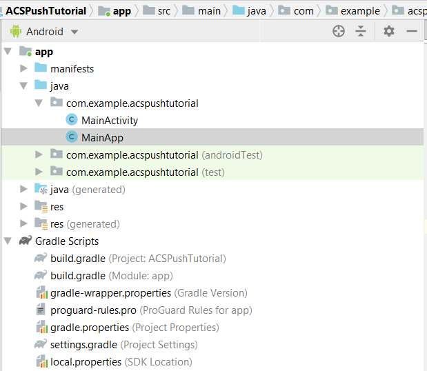
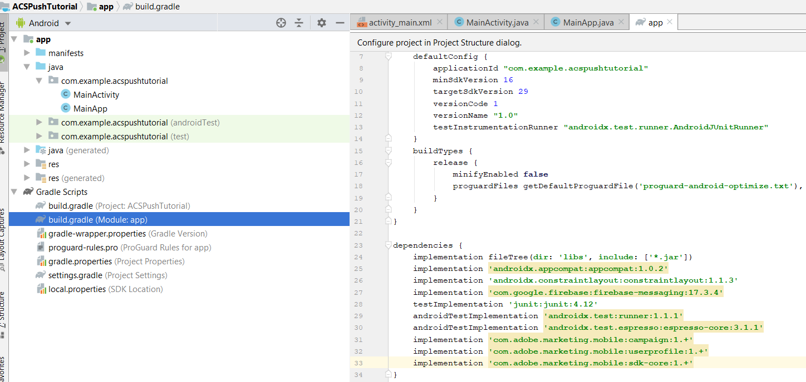

# 2단계 - [!UICONTROL Mobile SDK]을(를) Android 앱과 통합

이 부분에서는 [!DNL Android] 앱을 [!UICONTROL Mobile SDK]과(와) 통합합니다. [!UICONTROL mobile SDK]을(를) [!DNL Android] 앱과 통합하려면 다음 단계를 따르십시오.

* [!DNL Android Studio]에서 *ACSPushTutorial* 프로젝트를 엽니다.
* [!DNL android.app.Application]을(를) 확장하는 *MainApp*&#x200B;이라는 새 Java 클래스를 만듭니다.
* 이 시점의 프로젝트 구조는 다음과 같아야 합니다



* [!DNL Gradle Scripts] 폴더를 확장합니다. 모듈의 [!DNL build.gradle]을(를) 두 번 클릭합니다. [!DNL build.gradle] 파일의 종속성 섹션에 다음 종속성을 붙여 넣으십시오. 이제 [!DNL build.gradle] 파일은 다음과 같습니다.

<!--
Removed `{.line-numbers}` below
-->

```java
implementation 'com.adobe.marketing.mobile:campaign:1.+'
implementation 'com.adobe.marketing.mobile:userprofile:1.+'
implementation 'com.adobe.marketing.mobile:sdk-core:1.+'
```



* 지금 동기화 단추를 클릭하여 [!DNL Android] 프로젝트를 동기화하여 프로젝트를 동기화합니다.

## [!DNL AndroidManifest.xml] 수정{#modify-android-manifest}

*AndroidManifest.xml*&#x200B;을 열고 manifest 요소 뒤와 application 요소 앞에 다음 2줄을 붙여 넣습니다. 이렇게 하면 앱이 외부 세계와 통신할 수 있습니다

<!--
Removed `{.line-numbers}` below
-->

```xml
<uses-permission android:name="android.permission.INTERNET" />
<uses-permission android:name="android.permission.ACCESS_NETWORK_STATE" />
```

응용 프로그램 요소에서 다음 줄을 복사합니다.
[!DNL android:name=&quot;.MainApp&quot;]
저장 [!DNL AndroidManifest.xml]
[!DNL AndroidManifest.xml]은(는) 다음과 같아야 합니다.

<!--
Removed `{.line-numbers}` below
-->

```xml
<?xml version="1.0" encoding="utf-8"?>
<manifest xmlns:android="http://schemas.android.com/apk/res/android"
    package="com.example.acspushtutorial">
    <uses-permission android:name="android.permission.INTERNET" />
    <uses-permission android:name="android.permission.ACCESS_NETWORK_STATE" />

<application
    android:name=".MainApp"
    android:allowBackup="true"
    android:icon="@mipmap/ic_launcher"
    android:label="@string/app_name"
    android:roundIcon="@mipmap/ic_launcher_round"
    android:supportsRtl="true"
    android:theme="@style/AppTheme">

<activity android:name=".MainActivity">
<intent-filter>
    <action android:name="android.intent.action.MAIN" />
    <category android:name="android.intent.category.LAUNCHER" />
</intent-filter>
</activity>
</application>

</manifest>
```
